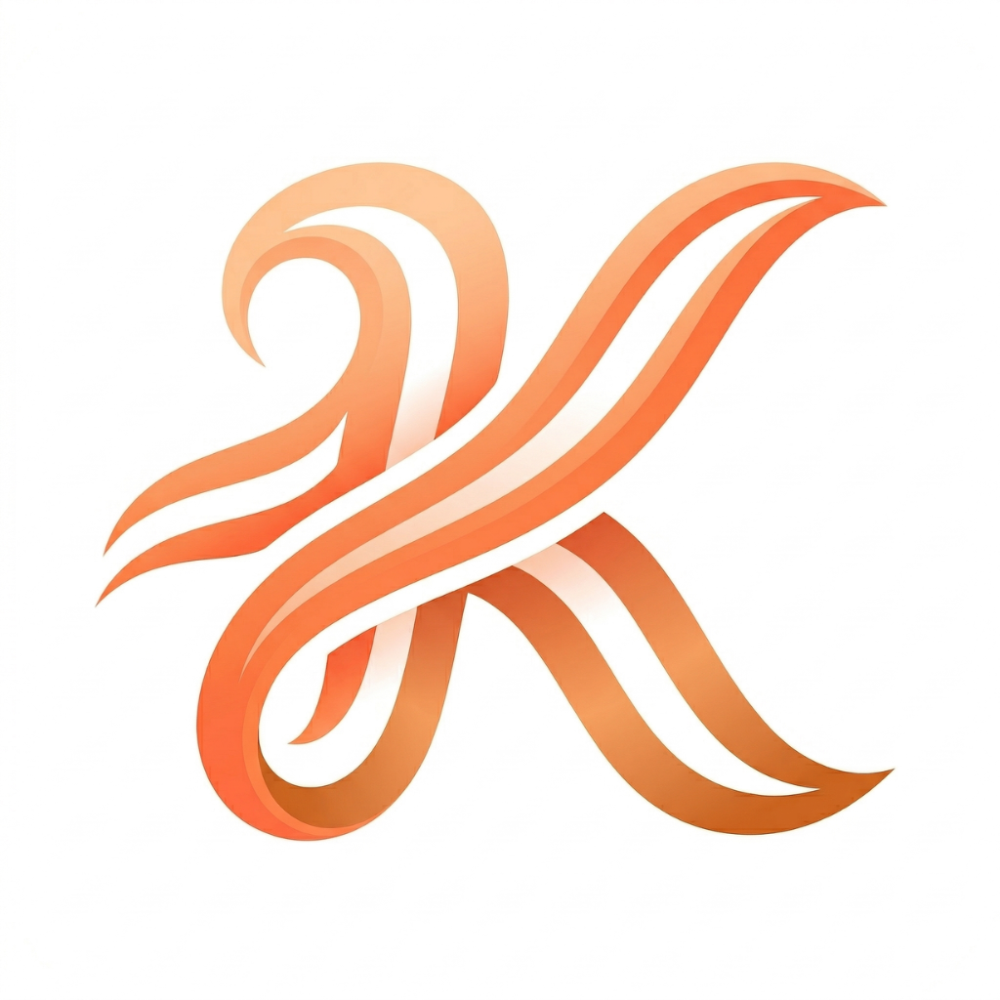

<h1 align="center">
  <br/>
  Kazemi
</h1>

<p align="center">
  <strong>Your Personal Media Library for iOS & macOS</strong>
</p>

<p align="center">
  <a href="https://github.com/kazemiapp/Kazemi/releases/latest">
    
  </a>
  
</p>

<p align="center">
  <a href="https://kazemiapp.github.io/">🌐 kazemiapp.github.io</a>
</p>

---

## About Kazemi

Kazemi is a modern media player and library manager for iOS and macOS. Organize your personal video collection with a beautiful, intuitive interface and powerful features.

Perfect for:
- 📁 **Home videos** - Family events, celebrations, and memories
- 🎬 **Independent films** - Your personal film collection
- 📚 **Educational content** - Courses, tutorials, and lectures
- 🎨 **Creative projects** - Portfolio videos and presentations

---

## Download

### Install via AltStore (Recommended)

<a href="altstore://install?url=https://github.com/kazemiapp/Kazemi/releases/download/v1.0/Kazemi.ipa">
  
</a>

This will open AltStore and automatically install Kazemi.

### Manual Download

| Version | Download |
|---------|----------|
| Latest stable | [⬇ Download IPA](https://github.com/kazemiapp/Kazemi/releases/latest/download/Kazemi.ipa) |
| All releases | [Releases page](https://github.com/kazemiapp/Kazemi/releases) |

### Installation

Sideload the IPA using:
- **AltStore** (recommended) - for automatic updates
- **Sideloadly** - manual installation
- Any other compatible sideloading tool

> **Note:** You'll need to refresh the app every 7 days (or 1 year with Apple Developer account) to keep it working.

---

## Features

### 📦 Extension System
Kazemi uses a unique JavaScript extension system that allows you to customize how content is organized and accessed. Extensions run in a secure, sandboxed environment.

### 📁 Local Media Library
Organize your video files in a simple folder structure:

```
MyMedia/
├── Family Vacation 2024/
│   ├── day1.mp4
│   ├── day2.mp4
│   └── cover.jpg
└── Birthday Party/
    ├── ceremony.mp4
    └── celebration.mp4
```

### 🎬 Video Playback
- Full-screen video player with gesture controls
- Subtitle support (VTT format)
- Playback speed control
- Remember last position

### 📚 Library Management
- Bookmark your favorite content
- Track watch history
- Organize by folders and categories
- Automatic metadata from info.json files

### 🌐 Multi-language Support
- English
- Spanish (Español)
- Chinese (中文)

### 🎨 Beautiful Design
- Dark and Light themes
- Follows system appearance
- Smooth animations and transitions

---

## Getting Started

### 1. Install Kazemi
Download and install using AltStore or your preferred sideloading method.

### 2. Prepare Your Media
Organize your video files in folders. Each folder represents a "series" or collection.

### 3. Add Optional Metadata
Create an `info.json` file in each folder for custom titles and descriptions:

```json
{
  "title": "Family Vacation 2024",
  "synopsis": "Our amazing trip to the mountains",
  "year": 2024
}
```

### 4. Import in Kazemi
- Open Kazemi
- Go to Settings → Local Library
- Select your media folder
- Start browsing your collection!

---

## Extension Development

Kazemi supports JavaScript extensions for advanced users who want to customize their experience.

### Source Extensions
Create custom content sources by writing JavaScript files that define how to fetch and organize media information.

### Extractor Extensions
Build extractors to handle different video formats and streaming protocols.

See our [documentation](https://kazemiapp.github.io/) for detailed extension development guides.

---

## Support Kazemi

Kazemi is a passion project built with love. Your support directly contributes to:

- 🍎 **App Store Release** — Covering the Apple Developer Program fee ($99/year) and App Store compliance costs
- 📱 **Future Android Version** — We're planning to bring Kazemi to Android devices, and your support helps make this happen
- 🚀 **New Features** — Funding ongoing development and improvements

| Tier | Benefit |
|------|---------|
| Any amount | Your name in the **supporters list** inside the app |
| $5+ | Early access to **beta builds** |
| $15+ | Priority in the **feature request board** |
| $30+ | **Lifetime Pro** — all future premium features (iOS + Android) |

<p align="center">
  <a href="https://ko-fi.com/kazemiapp">
    
  </a>
</p>

---

## Requirements

- **iOS:** 16.0 or later
- **macOS:** 13.0 or later
- **Storage:** Varies based on downloaded content

---

## Links

- 🌐 **Website:** [kazemiapp.github.io](https://kazemiapp.github.io/)
- 📱 **Releases:** [GitHub Releases](https://github.com/kazemiapp/Kazemi/releases)
- 💬 **Issues:** [Report a bug](https://github.com/kazemiapp/Kazemi/issues)
- 💛 **Support:** [Ko-fi](https://ko-fi.com/kazemiapp)

---

<p align="center">
  Made with ♥ by the Kazemi Team
</p>
